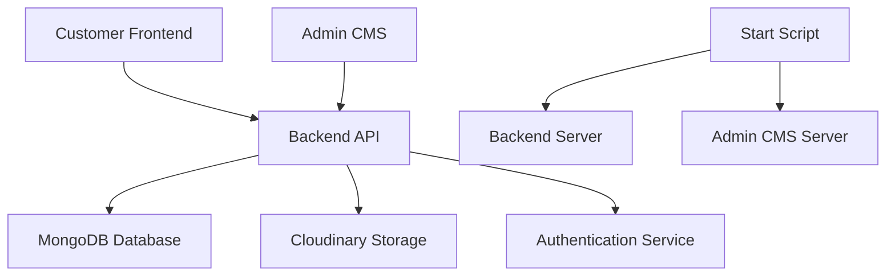
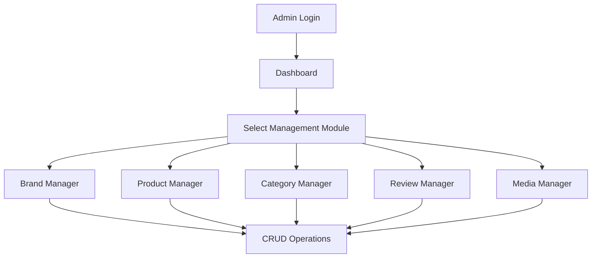

# PhotuPrint Complete Workflow Documentation

## 📋 Table of Contents

1. [System Overview](#-system-overview)
2. [Development Workflow](#-development-workflow)
3. [Admin CMS Workflow](#-admin-cms-workflow)
4. [Product Management Workflow](#-product-management-workflow)
5. [Customer Journey Workflow](#-customer-journey-workflow)
6. [Order Processing Workflow](#-order-processing-workflow)
7. [Content Management Workflow](#-content-management-workflow)
8. [User Management Workflow](#-user-management-workflow)
9. [File Upload Workflow](#-file-upload-workflow)
10. [Authentication Workflow](#-authentication-workflow)
11. [API Integration Workflow](#-api-integration-workflow)
12. [Database Operations Workflow](#-database-operations-workflow)
13. [Deployment Workflow](#-deployment-workflow)
14. [Maintenance Workflow](#-maintenance-workflow)
15. [Troubleshooting Workflow](#-troubleshooting-workflow)

---

## 🏗️ System Overview

### Architecture Flow



### Technology Stack Flow

```
Frontend (React) → API Calls → Backend (Express/Node.js) → Database (MongoDB)
                                     ↓
                              File Storage (Cloudinary)
```

---

## 🔄 Development Workflow

### 1. Initial Setup Workflow

```bash
# Step 1: Environment Preparation
git clone <repository-url>
cd PP

# Step 2: Dependencies Installation
npm install                    # Root dependencies
cd admin-cms && npm install   # Admin CMS dependencies
cd ..

# Step 3: Environment Configuration
cp .env.example .env          # Copy environment template
# Edit .env with your configurations

# Step 4: Database Setup
# Start MongoDB service
# Create database: photuprint

# Step 5: Start Development Servers
chmod +x start-servers.sh
./start-servers.sh
```

### 2. Feature Development Workflow

```bash
# Step 1: Create Feature Branch
git checkout -b feature/new-feature-name

# Step 2: Development Process
# - Backend: Edit controllers, models, routes
# - Frontend: Edit components, pages, styles
# - Admin: Edit admin components and pages

# Step 3: Testing
npm run dev                   # Start backend
cd admin-cms && npm start    # Start frontend

# Step 4: Code Review
# - Check functionality
# - Test API endpoints
# - Verify UI/UX

# Step 5: Commit Changes
git add .
git commit -m "feat: add new feature description"
git push origin feature/new-feature-name
```

### 3. Code Integration Workflow

```bash
# Step 1: Pull Latest Changes
git checkout main
git pull origin main

# Step 2: Merge Feature Branch
git merge feature/new-feature-name

# Step 3: Resolve Conflicts (if any)
# Edit conflicting files
git add .
git commit -m "resolve: merge conflicts"

# Step 4: Push to Main
git push origin main
```

---

## 🎛️ Admin CMS Workflow

### 1. Admin Login Workflow

```
1. Navigate to http://localhost:3000
2. Enter credentials:
   - Email: admin@photuprint.com
   - Password: admin123
3. System validates credentials via JWT
4. Redirect to dashboard on success
5. Access admin features based on role
```

### 2. Dashboard Navigation Workflow

```
Dashboard Layout:
├── Left Container (Navigation)
│   ├── Product Management
│   ├── Attribute Management
│   ├── Content Management
│   └── User Management
└── Right Container (Content Area)
    └── Dynamic component rendering based on route
```

### 3. Admin Feature Access Workflow



---

## 🛍️ Product Management Workflow

### 1. Product Creation Workflow

```
Step 1: Access Product Manager
├── Navigate to /dashboard/addproducts
├── Load product form component
└── Initialize empty product state

Step 2: Product Information Entry
├── Basic Details
│   ├── Product Name (required)
│   ├── Description
│   ├── Price (required)
│   └── SKU (auto-generated/manual)
├── Categorization
│   ├── Select Category
│   ├── Select Subcategory
│   └── Select Brand
└── Attributes
    ├── Colors (multiple selection)
    ├── Sizes (multiple selection)
    ├── Materials
    └── Other attributes

Step 3: Media Upload
├── Main Product Image (required)
├── Additional Images (optional)
├── Product Videos (optional)
└── Cloudinary integration for storage

Step 4: Inventory Management
├── Stock Quantity
├── Stock Status
└── Availability settings

Step 5: Product Validation & Save
├── Client-side validation
├── API call to /api/products (POST)
├── Server-side validation
├── Database storage
└── Success/Error response
```

### 2. Product Update Workflow

```
Step 1: Product Selection
├── Navigate to product list
├── Search/Filter products
└── Select product to edit

Step 2: Load Existing Data
├── API call to /api/products/:id (GET)
├── Populate form with existing data
└── Load associated media

Step 3: Modify Product Data
├── Update any field
├── Add/Remove images
├── Modify attributes
└── Change inventory

Step 4: Save Changes
├── API call to /api/products/:id (PUT)
├── Update database
├── Update search indexes
└── Refresh product cache
```

### 3. Product Deletion Workflow

```
Step 1: Product Selection
├── Navigate to product list
└── Select product to delete

Step 2: Confirmation Process
├── Display deletion warning
├── Confirm action
└── Check for dependencies (orders, reviews)

Step 3: Deletion Process
├── API call to /api/products/:id (DELETE)
├── Remove from database
├── Delete associated media
├── Update related records
└── Refresh product list
```

---

## 🎨 Attribute Management Workflow

### 1. Color Management Workflow

```
Color Creation:
1. Navigate to /dashboard/addcolor
2. Enter color details:
   - Color Name
   - Color Code (HEX/RGB)
   - Color Description
3. Preview color swatch
4. Save to database via /api/colors (POST)

Color Usage:
1. Colors appear in product creation form
2. Multiple colors can be assigned to products
3. Frontend displays color selector component
4. Customer can filter products by color
```

### 2. Size Management Workflow

```
Size Creation:
1. Navigate to /dashboard/addsize
2. Define size parameters:
   - Size Name (S, M, L, XL, etc.)
   - Size Category (Clothing, Shoes, etc.)
   - Measurements (optional)
3. Save to database via /api/sizes (POST)

Size Usage:
1. Sizes available in product creation
2. Size variants affect pricing/inventory
3. Customer size selection in product details
4. Size-based filtering in product catalog
```

### 3. Category Management Workflow

```
Category Hierarchy:
Main Category → Subcategory → Products

Category Creation:
1. Navigate to /dashboard/addcategory
2. Enter category details:
   - Category Name
   - Category Description
   - Category Image (optional)
   - SEO metadata
3. Save via /api/categories (POST)

Subcategory Creation:
1. Navigate to /dashboard/addsubcategory
2. Select parent category
3. Enter subcategory details
4. Save via /api/subcategories (POST)
```

---

## 👤 Customer Journey Workflow

### 1. Customer Registration Workflow

```
Step 1: Access Registration
├── Navigate to registration page
├── Choose registration method
└── Enter required information

Step 2: Account Creation
├── Personal Information
│   ├── Full Name
│   ├── Email Address
│   └── Phone Number
├── Account Security
│   ├── Password (encrypted with bcrypt)
│   └── Confirm Password
└── Terms & Conditions acceptance

Step 3: Account Verification
├── Email verification (optional)
├── Account activation
└── Welcome email/message

Step 4: Profile Setup
├── Additional personal details
├── Shipping addresses
├── Preferences
└── Newsletter subscription
```

### 2. Product Discovery Workflow

```
Step 1: Product Browsing
├── Homepage product showcase
├── Category-based navigation
├── Search functionality
└── Filter options

Step 2: Product Filtering
├── By Category/Subcategory
├── By Price Range
├── By Color
├── By Size
├── By Brand
├── By Material
└── By Customer Reviews

Step 3: Product Details View
├── Product images gallery
├── Product description
├── Price information
├── Available variants (colors/sizes)
├── Customer reviews
├── Related products
└── Add to cart option
```

### 3. Shopping Cart Workflow

```
Step 1: Add to Cart
├── Select product variant
├── Choose quantity
├── Add to shopping cart
└── Update cart total

Step 2: Cart Management
├── View cart contents
├── Modify quantities
├── Remove items
├── Apply coupons/discounts
└── Calculate totals

Step 3: Checkout Process
├── Review cart items
├── Enter shipping information
├── Select payment method
├── Apply final discounts
└── Place order
```

---

## 📦 Order Processing Workflow

### 1. Order Creation Workflow

```
Step 1: Order Initialization
├── Customer places order
├── Generate unique order ID
├── Create order record in database
└── Initialize order status as 'pending'

Step 2: Payment Processing
├── Validate payment information
├── Process payment via Stripe
├── Update payment status
└── Send payment confirmation

Step 3: Order Confirmation
├── Send order confirmation email
├── Update inventory levels
├── Generate order receipt
└── Notify admin of new order

Step 4: Order Fulfillment
├── Admin reviews order
├── Update order status to 'processing'
├── Prepare items for shipping
└── Generate shipping labels
```

### 2. Order Status Management Workflow

```
Order Status Flow:
Pending → Processing → Shipped → Delivered → Completed

Status Updates:
1. Admin updates order status
2. Customer receives notifications
3. Tracking information provided
4. Delivery confirmation
5. Order completion
```

### 3. Order Tracking Workflow

```
Step 1: Order Placement
├── Order ID generation
├── Initial status: 'Pending'
└── Customer notification

Step 2: Processing Updates
├── Status: 'Processing'
├── Estimated delivery date
└── Progress notifications

Step 3: Shipping Updates
├── Status: 'Shipped'
├── Tracking number
├── Carrier information
└── Delivery tracking

Step 4: Delivery Confirmation
├── Status: 'Delivered'
├── Delivery timestamp
├── Delivery confirmation
└── Review request
```

---

## 📝 Content Management Workflow

### 1. Review Management Workflow

```
Review Submission:
1. Customer submits product review
2. Review stored with 'pending' status
3. Admin notification sent

Review Moderation:
1. Navigate to /dashboard/reviewlist
2. View pending reviews
3. Review content for appropriateness
4. Approve or reject review
5. Update review status
6. Notify customer of decision

Review Display:
1. Approved reviews appear on product pages
2. Calculate average ratings
3. Display review statistics
4. Sort reviews by date/rating
```

### 2. Media Management Workflow

```
Media Upload Process:
1. Navigate to /dashboard/addMedia
2. Select files (images/videos)
3. File validation (size, format)
4. Upload to Cloudinary
5. Generate public URLs
6. Store metadata in database
7. Associate with products/content

Media Organization:
├── Product Images
├── Brand Logos
├── Category Images
├── Banner Images
└── Video Content

Media Optimization:
├── Automatic resizing
├── Format conversion
├── Compression
└── CDN delivery
```

---

## 🔐 Authentication Workflow

### 1. JWT Authentication Flow

```
Login Process:
1. User submits credentials
2. Server validates credentials
3. Password verification with bcrypt
4. Generate JWT token
5. Return token to client
6. Client stores token (localStorage/cookies)

Token Usage:
1. Client includes token in API requests
2. Server validates token middleware
3. Extract user information from token
4. Authorize based on user role
5. Proceed with request or deny access

Token Refresh:
1. Check token expiration
2. Request new token if expired
3. Update stored token
4. Continue with authenticated requests
```

### 2. Role-Based Access Control

```
User Roles:
├── Admin
│   ├── Full system access
│   ├── User management
│   ├── Product management
│   └── System configuration
├── Editor
│   ├── Content management
│   ├── Product editing
│   └── Review moderation
└── Customer
    ├── Product browsing
    ├── Order placement
    └── Profile management

Permission Checks:
1. Extract user role from JWT
2. Check route permissions
3. Validate action permissions
4. Allow or deny access
5. Return appropriate response
```

---

## 🔌 API Integration Workflow

### 1. RESTful API Design Pattern

```
API Structure:
├── /api/auth
│   ├── POST /register
│   ├── POST /login
│   └── POST /logout
├── /api/products
│   ├── GET /products (list)
│   ├── GET /products/:id (detail)
│   ├── POST /products (create)
│   ├── PUT /products/:id (update)
│   └── DELETE /products/:id (delete)
├── /api/categories
├── /api/orders
├── /api/users
└── /api/reviews
```

### 2. API Request/Response Flow

```
Client Request Flow:
1. Client prepares request
2. Add authentication headers
3. Send HTTP request
4. Server receives request
5. Middleware processing
6. Route handler execution
7. Database operations
8. Response generation
9. Send response to client
10. Client processes response

Error Handling Flow:
1. Catch errors in try-catch blocks
2. Log error details
3. Generate user-friendly error message
4. Return appropriate HTTP status code
5. Client displays error message
```

### 3. API Documentation Workflow

```
Endpoint Documentation:
├── Method (GET, POST, PUT, DELETE)
├── URL pattern
├── Request parameters
├── Request body schema
├── Response schema
├── Error responses
├── Authentication requirements
└── Usage examples

Testing Workflow:
1. Use Postman/Insomnia for API testing
2. Test all CRUD operations
3. Verify authentication
4. Test error scenarios
5. Validate response formats
6. Performance testing
```

---

## 🗄️ Database Operations Workflow

### 1. MongoDB Connection Workflow

```
Database Connection:
1. Load environment variables
2. Construct MongoDB URI
3. Establish connection using Mongoose
4. Handle connection events
5. Set up error handling
6. Initialize database indexes
7. Seed initial data (if needed)

Connection Management:
├── Connection pooling
├── Automatic reconnection
├── Connection monitoring
├── Error recovery
└── Graceful shutdown
```

### 2. Data Model Relationships

```
Database Schema Relationships:

User Model:
├── Has many Orders
├── Has many Reviews
└── Role-based permissions

Product Model:
├── Belongs to Category
├── Belongs to Subcategory
├── Belongs to Brand
├── Has many Colors (refs)
├── Has many Sizes (refs)
├── Has many Reviews
└── Has many OrderItems

Order Model:
├── Belongs to User
├── Has many OrderItems
└── Has payment information

Review Model:
├── Belongs to User
├── Belongs to Product
└── Has moderation status
```

### 3. Database Operations Flow

```
CRUD Operations:

Create:
1. Validate input data
2. Check for duplicates
3. Generate unique identifiers
4. Save to database
5. Handle errors
6. Return created document

Read:
1. Parse query parameters
2. Build database query
3. Apply filters/sorting
4. Execute query
5. Populate references
6. Return results

Update:
1. Find existing document
2. Validate update data
3. Apply changes
4. Save updated document
5. Return updated document

Delete:
1. Find document to delete
2. Check for dependencies
3. Remove document
4. Clean up references
5. Confirm deletion
```

---

## 🚀 Deployment Workflow

### 1. Production Build Workflow

```
Frontend Build:
1. Navigate to admin-cms directory
2. Run production build: npm run build
3. Optimize assets (minification, compression)
4. Generate static files
5. Configure environment variables
6. Test production build locally

Backend Preparation:
1. Set NODE_ENV=production
2. Configure production database
3. Set up environment variables
4. Install production dependencies only
5. Configure logging
6. Set up process management (PM2)
```

### 2. Server Deployment Workflow

```
Deployment Steps:
1. Choose deployment platform
   ├── Heroku (PaaS)
   ├── DigitalOcean (VPS)
   ├── AWS (Cloud)
   └── Vercel/Netlify (Frontend)

2. Server Setup:
   ├── Install Node.js
   ├── Install MongoDB
   ├── Configure firewall
   ├── Set up SSL certificates
   └── Configure reverse proxy (Nginx)

3. Application Deployment:
   ├── Clone repository
   ├── Install dependencies
   ├── Set environment variables
   ├── Build applications
   ├── Start services
   └── Configure monitoring

4. Post-Deployment:
   ├── Test all functionality
   ├── Monitor performance
   ├── Set up backups
   ├── Configure alerts
   └── Document deployment
```

### 3. CI/CD Pipeline Workflow

```yaml
# Example GitHub Actions Workflow
name: Deploy to Production

on:
  push:
    branches: [main]

jobs:
  test:
    runs-on: ubuntu-latest
    steps:
      - uses: actions/checkout@v2
      - name: Setup Node.js
        uses: actions/setup-node@v2
        with:
          node-version: "18"
      - name: Install dependencies
        run: npm install
      - name: Run tests
        run: npm test

  deploy:
    needs: test
    runs-on: ubuntu-latest
    steps:
      - name: Deploy to server
        run: |
          # Deployment commands
          ssh user@server 'cd /app && git pull && npm install && pm2 restart all'
```

---

## 🔧 Maintenance Workflow

### 1. Regular Maintenance Tasks

```
Daily Tasks:
├── Monitor server performance
├── Check error logs
├── Verify backup completion
├── Monitor database performance
└── Check security alerts

Weekly Tasks:
├── Update dependencies
├── Review user feedback
├── Analyze performance metrics
├── Clean up temporary files
└── Test backup restoration

Monthly Tasks:
├── Security audit
├── Performance optimization
├── Database maintenance
├── Update documentation
└── Review and update monitoring
```

### 2. Database Maintenance Workflow

```
Database Optimization:
1. Analyze query performance
2. Optimize slow queries
3. Update database indexes
4. Clean up orphaned records
5. Compress old data
6. Monitor storage usage

Backup Strategy:
1. Automated daily backups
2. Weekly full backups
3. Test backup restoration
4. Store backups securely
5. Document recovery procedures
6. Monitor backup integrity
```

### 3. Security Maintenance Workflow

```
Security Tasks:
1. Update dependencies regularly
2. Monitor security vulnerabilities
3. Review access logs
4. Update SSL certificates
5. Audit user permissions
6. Check for suspicious activity
7. Update security policies
8. Conduct penetration testing
```

---

## 🔍 Troubleshooting Workflow

### 1. Common Issues Resolution

```
Server Won't Start:
1. Check port availability
   - lsof -ti:8080 | xargs kill -9
2. Verify environment variables
3. Check MongoDB connection
4. Review error logs
5. Validate configuration files

Database Connection Issues:
1. Verify MongoDB service status
2. Check connection string
3. Test network connectivity
4. Review authentication credentials
5. Check firewall settings

Frontend Build Errors:
1. Clear node_modules and reinstall
2. Check for syntax errors
3. Verify import statements
4. Update dependencies
5. Check build configuration
```

### 2. Error Logging and Monitoring

```
Error Tracking:
1. Implement comprehensive logging
2. Use structured logging format
3. Set up log aggregation
4. Configure error alerts
5. Monitor application metrics
6. Track user interactions
7. Set up performance monitoring

Log Analysis:
1. Regular log review
2. Identify error patterns
3. Track performance trends
4. Monitor user behavior
5. Generate reports
6. Set up dashboards
```

### 3. Performance Troubleshooting

```
Performance Issues:
1. Identify bottlenecks
   ├── Database queries
   ├── API response times
   ├── Frontend rendering
   └── Network latency

2. Optimization Strategies:
   ├── Database indexing
   ├── Query optimization
   ├── Caching implementation
   ├── Code splitting
   ├── Image optimization
   └── CDN usage

3. Monitoring Tools:
   ├── Application Performance Monitoring (APM)
   ├── Database performance tools
   ├── Frontend performance metrics
   └── Server monitoring
```

---

## 📊 Analytics and Reporting Workflow

### 1. User Analytics

```
User Behavior Tracking:
├── Page views and navigation
├── Product interactions
├── Search queries
├── Cart abandonment
├── Conversion rates
└── User session duration

Implementation:
1. Integrate analytics tools (Google Analytics, etc.)
2. Set up custom event tracking
3. Configure conversion goals
4. Create user segments
5. Generate regular reports
```

### 2. Business Intelligence

```
Key Metrics:
├── Sales performance
├── Product popularity
├── Customer acquisition
├── Revenue trends
├── Inventory turnover
└── Customer lifetime value

Reporting:
1. Daily sales reports
2. Weekly performance summaries
3. Monthly business reviews
4. Quarterly trend analysis
5. Annual business reports
```

---

## 🔄 Backup and Recovery Workflow

### 1. Backup Strategy

```
Backup Types:
├── Database backups (MongoDB dumps)
├── File system backups (uploaded media)
├── Application code backups (Git repository)
├── Configuration backups (environment files)
└── Documentation backups

Backup Schedule:
├── Real-time: Database replication
├── Daily: Incremental backups
├── Weekly: Full system backups
├── Monthly: Archive backups
└── Quarterly: Disaster recovery tests
```

### 2. Recovery Procedures

```
Recovery Scenarios:
1. Database corruption
2. Server failure
3. Data center outage
4. Security breach
5. Human error

Recovery Steps:
1. Assess the situation
2. Identify recovery point
3. Restore from backups
4. Verify data integrity
5. Test system functionality
6. Document incident
7. Update recovery procedures
```

---

## 📈 Scaling Workflow

### 1. Horizontal Scaling

```
Load Balancing:
1. Set up multiple server instances
2. Configure load balancer
3. Implement session management
4. Database clustering
5. CDN implementation
6. Caching strategies

Microservices Migration:
1. Identify service boundaries
2. Extract services gradually
3. Implement API gateway
4. Set up service discovery
5. Configure monitoring
6. Implement circuit breakers
```

### 2. Performance Optimization

```
Frontend Optimization:
├── Code splitting
├── Lazy loading
├── Image optimization
├── Caching strategies
├── Bundle optimization
└── Progressive Web App features

Backend Optimization:
├── Database indexing
├── Query optimization
├── Caching layers
├── API rate limiting
├── Connection pooling
└── Asynchronous processing
```

---

This comprehensive workflow documentation covers all aspects of the PhotuPrint system from development to production. Each workflow provides step-by-step guidance for developers, administrators, and maintainers to effectively work with the system.

For specific implementation details, refer to the technical documentation and API references in the respective component directories.
